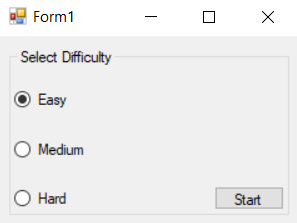
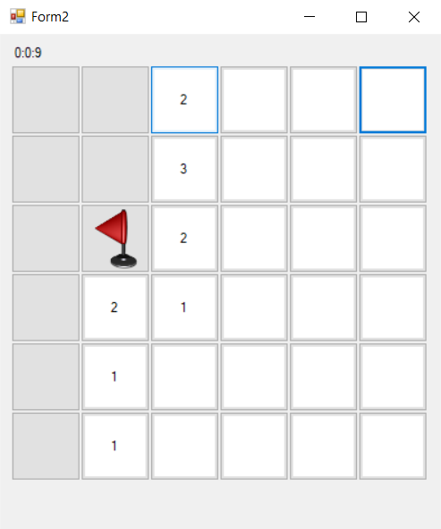
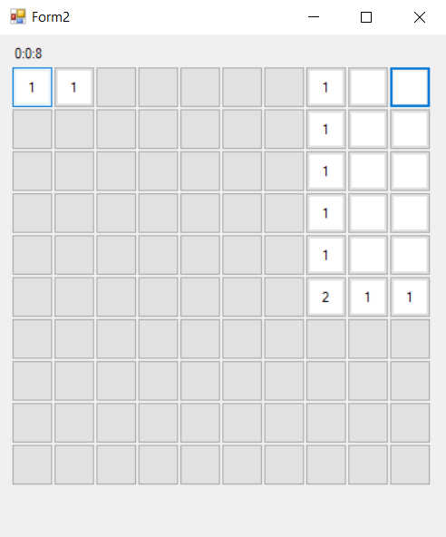
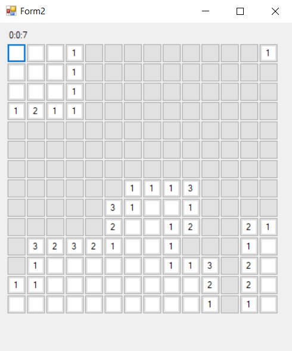
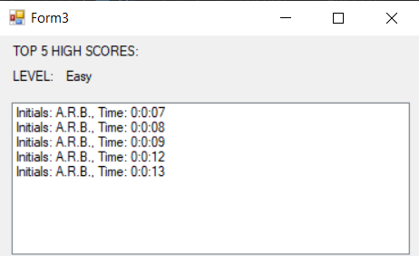

# Minesweeper C# App
An object-oriented Windows Application developed in Visual Studio

## Features

* 3 levels of difficulty

* Easy difficulty
* 6x6 2d array used to handle tile objects
* Right click to place flag on a tile
* Recursion used to reveal tiles with 0 neighbors

* Medium difficulty
* 10x10 2d array used to handle tile objects

* Hard difficulty
* 14x14 2d array used to handle tile objects

* Top 5 fastest times of the difficulty are displayed when the game is completed
